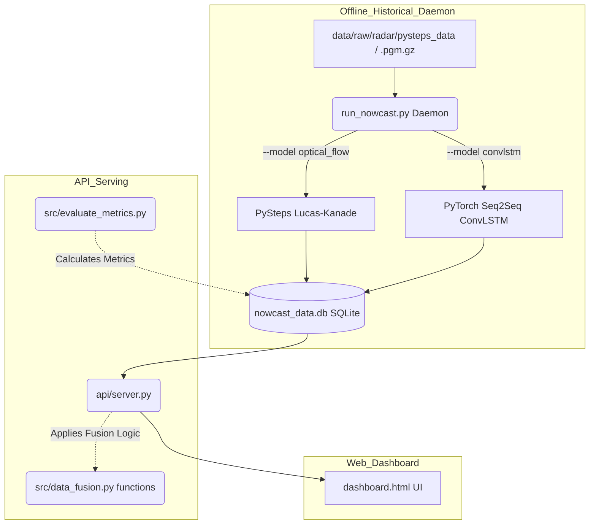

# Current System Architecture

This document describes the *actual* implemented state of the codebase. The system functions as a decoupled background processing daemon and API server working on historical data.

## 1. High-Level Pipeline Overview

The pipeline currently has the following implemented stages:
- **Ingestion**: A historical replay daemon reads sample `.pgm.gz` radar files from local disk continuously.
- **Model / Nowcasting**: Supports two models via configuration flag:
  1. `optical_flow`: Lucas-Kanade extrapolation via `pysteps` (baseline).
  2. `convlstm`: A Seq2Seq PyTorch ConvLSTM deep learning model.
- **Storage/IPC**: Forecasts, hazard alerts, storm cells, and metrics are saved to a SQLite database (`data/processed/nowcast_data.db`) using Python UDFs to simulate SpatiaLite (`ST_Intersects`) for spatial queries. This replaces the legacy JSON/`.npy` flat-file passing, enabling historical queries and resolving concurrency issues between daemon and server.
- **Preprocessing/Fusion**: The server dynamically combines the real radar data with *physically-informed simulated* satellite and lightning data, derived directly from the real radar reflectivity field using empirical meteorological relationships (e.g., Petersen & Rutledge 1992, Vicente et al. 1998).
- **Inference/Serving**: A FastAPI server loads the serialized arrays and serves them as map tile images and JSON APIs.
- **Dashboard**: A frontend UI that visualizes the historical replay and fetches real evaluation metrics.

## 2. Pipeline Stages & Implementation

### Data Ingestion & Model Daemon
- **Files**: `run_nowcast.py`
- **Logic**: Acts as a continuous background daemon. Uses `pysteps.io` to read a rolling window of historical radar frames (`*20160928*.pgm.gz`), computes optical flow, and saves arrays (`radar_obs.npy`, `radar_forecast.npy`) and JSON alerts.
- **Status**: Live streaming is simulated via a "Historical Replay" loop.

### Preprocessing & Fusion
- **Files**: `src/data_fusion.py` (logic), `api/server.py` (execution)
- **Logic**: Applies mathematical transformations (`generate_insat_satellite_ctt`, `generate_lightning_density_grid`) on the real radar grid to artificially generate satellite Cloud Top Temperature (CTT) and lightning density. 
- **Status**: Completely stubbed/mocked for satellite and lightning data, but clearly labeled as "Simulated" in the API and UI.

### Inference / Serving
- **Files**: `api/server.py`
- **Logic**: A FastAPI server that exposes `/api/layer`, `/api/alerts`, `/api/metrics`, and `/api/dispatches`.
- **Status**: It successfully decouples from the heavy processing by reading the `.npy` files written by the daemon. Returns `"data_source": "historical_replay"` to be fully transparent.

### Dashboard
- **Files**: `dashboard/dashboard.html`
- **Logic**: A Leaflet.js based web UI that visualizes the data. It renders real PySteps evaluation metrics from `/api/metrics` and updates dynamic layers through a timeline slider spanning the 60-min forecast.

### Alert Dispatch
- **Files**: `src/alert_dispatcher.py`
- **Logic**: Reads `live_hazard_alerts.json` and formats them as strings (Aviation SIGMET, DDMA Civil, Farmer SMS). Can ping a Telegram webhook.

## 3. Data Flow Diagram

## 4. Actual External Dependencies

The `requirements.txt` file is accurate and uses the following:

- `pysteps` - Core library for reading radar data, optical flow, and advection extrapolation.
- `numpy`, `scipy` - Array manipulation, mathematical processing, and saving grid arrays.
- `matplotlib` - Generating image layers (colormaps and byte buffering) for the Leaflet maps.
- `fastapi`, `uvicorn` - Web server and API routing.
- `opencv-python` (`cv2`) - Computer vision ops.
